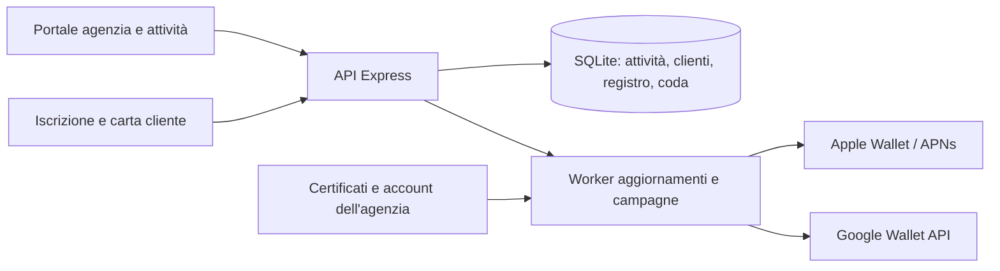

# Architettura di Fidelity Studio

Fidelity Studio è un'applicazione proprietaria per un'agenzia che gestisce programmi fedeltà di più attività. Il codice applicativo e il database sono ospitati sull'infrastruttura scelta dall'agenzia. L'emissione delle carte usa direttamente Apple Wallet e Google Wallet, senza un servizio white label o un intermediario per la gestione delle carte.

La proprietà del prodotto non elimina le dipendenze da sistemi operativi, hosting e librerie open source, né attribuisce diritti sulle API Apple/Google. Repository, dominio, account cloud, account sviluppatore, certificati e credenziali devono essere controllati dall'agenzia. Le dipendenze conservano le proprie licenze.

## Componenti

- **Frontend:** React e Vite; dashboard agenzia, programmi, clienti, operazioni al banco, campagne e impostazioni. Iscrizione e carta web sono pagine pubbliche separate dall'autenticazione degli operatori.
- **Backend:** Node.js 24 ed Express 5, TypeScript ESM. In produzione un processo serve API e frontend compilato dalla porta 3001. In sviluppo Vite usa la porta 5173 e inoltra le API al server.
- **Persistenza:** `node:sqlite`, con database in `DATABASE_PATH` (predefinito `data/fidelity.sqlite`). I file SQLite e gli eventuali WAL/SHM risiedono nello stesso volume persistente.
- **Wallet:** firma delle carte Apple con i certificati dell'agenzia; oggetti Google e link di salvataggio con service account dell'agenzia. Consultare [wallet-setup.md](wallet-setup.md) per configurazione e limiti.
- **Distribuzione:** immagine Docker Node 24 Debian Bookworm con OpenSSL, utente non privilegiato e filesystem applicativo in sola lettura. La directory dati e `/tmp` restano scrivibili.

## Perimetro funzionale

La prima versione comprende gestione di più attività, ruoli agenzia/titolare/operatore, programmi a timbri, punti e coupon, logo personalizzato, iscrizione QR/link, carta web, scanner al banco, registro operazioni, premi e storni, ricerca e segmentazione clienti, consenso marketing, esportazione e anonimizzazione, campagne, automazioni per clienti inattivi con intervallo minimo tra contatti, coda wallet e report essenziali.

I moduli di integrazione diretta non equivalgono a una pubblicazione sui wallet già verificata. Senza certificati, issuer e dominio HTTPS validi, la carta web e la gestione fedeltà restano utilizzabili; i wallet espongono uno stato non configurato. Nessuna notifica deve apparire come consegnata per la sola presenza di una riga in coda.

Sono estensioni successive: NFC/Smart Tap/VAS, integrazione con registratori di cassa e POS, accrediti o riscatti offline, fatturazione e pagamenti ricorrenti, app native, autenticazione multifattore, alta disponibilità e archiviazione analitica avanzata. Le indicazioni di prossimità dipendono dal supporto e dalle scelte dei wallet e non garantiscono l'invio di un messaggio al passaggio davanti al negozio.

## Regole sui dati

Il database è la fonte autorevole del saldo. I wallet ne mostrano una copia, aggiornata in modo asincrono: non usarli come conferma di un riscatto. Ogni operazione deve essere confermata dal server prima che il personale consegni il premio.

Un accredito o riscatto produce un movimento registrato con autore, importo, data e saldo risultante. Il server determina costo del premio e conversione della spesa in punti. Gli storni producono un ulteriore movimento; non riscrivono lo storico. La chiave di idempotenza evita che il ritentativo di una stessa richiesta produca un secondo movimento. La transazione SQLite deve comprendere controllo saldo, modifica e registro.

Gli identificativi di attività presenti nelle richieste non concedono accesso da soli. Gli operatori sono vincolati alla propria attività; l'agenzia può selezionare l'attività su cui operare. Tutte le letture e mutazioni amministrative devono rispettare questo confine, compresi export, campagne, audit e coda.

La carta pubblica usa un token non prevedibile: è una credenziale di accesso alla carta, da non inserire nei log o nei report pubblici. Il token non prova l'identità della persona che presenta il QR; il negoziante deve definire un controllo aggiuntivo per premi di valore. La carta pubblica non espone indirizzi email, telefoni o registro completo degli acquisti.

L'anonimizzazione rimuove i contatti e revoca subito il token pubblico. Un job dedicato richiede poi l'aggiornamento delle carte già emesse con dati anonimi, saldo nullo e stato revocato. Le registrazioni Apple vengono conservate al massimo sette giorni, così i dispositivi possono ricevere l'avviso e scaricare il pass aggiornato; successivamente il worker le elimina. L'aggiornamento dipende dalla disponibilità dei provider e dalla connessione dei dispositivi: non cancella fisicamente una carta già salvata sul telefono. La verifica live di questo flusso resta necessaria.

Il registro economico residuo resta pseudonimo per la ricostruzione delle operazioni; questo non equivale a stabilire automaticamente una corretta durata di conservazione. Informativa, finalità, tempi di conservazione e condizioni dei premi devono essere decisi prima dell'utilizzo reale. L'iscrizione pubblica in produzione richiede l'informativa e i termini dell'attività configurati.

## Sicurezza e funzionamento

Le sessioni usano cookie HttpOnly e richieste autenticate di modifica protette da token CSRF. L'origine delle richieste pubbliche di modifica viene controllata. In produzione servono HTTPS, dominio corretto e configurazione del proxy coerente con l'infrastruttura. Le credenziali dimostrative non devono esistere nel database pubblico.

Il worker registra tentativi e risultati delle integrazioni. Una risposta positiva di un provider indica accettazione tecnica, non visualizzazione sul dispositivo o lettura del messaggio. Devono essere distinguibili errori transitori, credenziali mancanti e operazioni concluse. Le campagne richiedono consenso marketing. Un invio Google dall'esito incerto, anche dopo un riavvio, viene escluso dai ritentativi automatici e dall'azione generica di riprova per evitare messaggi duplicati: occorre verificarne l'esito nel provider.

SQLite è una scelta iniziale per una singola istanza con disco locale persistente. Non condividere il file su NFS e non avviare più repliche del worker sullo stesso volume senza un progetto di concorrenza. La capacità sostenibile va misurata sui carichi reali; non è stato promesso un numero di transazioni o attività supportate. Crescita elevata o alta disponibilità richiederanno un database server e un sistema di accodamento adeguato.

## Verifica e fonti

La copertura delle verifiche è registrata in [acceptance.md](acceptance.md), separando implementazione, test automatici, controlli manuali e prove live. Un build riuscito non certifica sicurezza, conformità o comportamento sui dispositivi.

Il backup usa l'[API online di SQLite esposta da Node](https://nodejs.org/api/sqlite.html#sqlitebackupsourceDb-path-options), così comprende anche i dati già confermati nel WAL. Le API wallet sono documentate da [Apple](https://developer.apple.com/documentation/walletpasses) e [Google](https://developers.google.com/wallet/retail/loyalty-cards).
